# 방수명장 AS 대응 프로세스 플로우차트

## 📊 전체 시스템 아키텍처

```
┏━━━━━━━━━━━━━━━━━━━━━━━━━━━━━━━━━━━━━━━━━━━━━━━━━━━━━━━━━━┓
┃                   방수명장 AS 관리 시스템                    ┃
┃                    (HTML + JavaScript)                       ┃
┗━━━━━━━━━━━━━━━━━━━━━━━━━━━━━━━━━━━━━━━━━━━━━━━━━━━━━━━━━━┛
                              ↓
        ┌─────────────────────┴─────────────────────┐
        ↓                                             ↓
┌───────────────┐                          ┌────────────────┐
│  UI 레이어     │                          │ 데이터 레이어   │
│  (HTML/CSS)   │←─────────────────────────→│ (LocalStorage) │
└───────────────┘                          └────────────────┘
        ↓                                             ↓
┌───────────────┐                          ┌────────────────┐
│ 비즈니스 로직  │                          │  AI 분석 모듈   │
│ (JavaScript)  │←─────────────────────────→│ (Image API)    │
└───────────────┘                          └────────────────┘
        ↓                                             ↓
┌───────────────────────────────────────────────────────────┐
│                   파일 내보내기                            │
│         JSON / PDF / Excel / 사진 압축                     │
└───────────────────────────────────────────────────────────┘
```

---

## 🔄 메인 프로세스 플로우차트

```mermaid
flowchart TD
    Start([시작]) --> CheckExisting{기존 AS<br/>불러오기?}
    
    CheckExisting -->|예| LoadAS[기존 AS 목록 표시]
    CheckExisting -->|아니오| NewAS[새 AS 생성]
    
    LoadAS --> SelectAS[AS 선택]
    SelectAS --> LoadData[데이터 로드]
    LoadData --> Dashboard[대시보드 진입]
    
    NewAS --> GenerateID[접수번호 자동생성<br/>AS20260401-XXXX]
    GenerateID --> Step0
    
    %% 0단계: 공문 접수
    Step0[📄 0단계: AS 공문 접수<br/>선택사항]
    Step0 --> HasDocument{공문 있음?}
    
    HasDocument -->|예| UploadDoc[공문 사진 업로드]
    HasDocument -->|아니오| Step1
    
    UploadDoc --> ShowPreview[미리보기 표시]
    ShowPreview --> AIAnalysis[🤖 AI 분석 시작]
    
    AIAnalysis --> OCR[OCR 텍스트 인식]
    OCR --> ExtractInfo[주요 정보 추출<br/>발신처/일자/부위/증상]
    ExtractInfo --> UrgencyAI[긴급도 AI 판단]
    UrgencyAI --> CauseEstimate[예상 원인 추정]
    CauseEstimate --> PhotoAnalysis[첨부 사진 분석]
    PhotoAnalysis --> Recommendation[초기 조치 제안]
    Recommendation --> CustomerMsg[고객 응대 문안 생성]
    
    CustomerMsg --> ShowAIResult[AI 분석 결과 표시]
    ShowAIResult --> UserConfirm{사용자 확인}
    
    UserConfirm -->|수정| EditAIResult[분석 결과 수정]
    EditAIResult --> ShowAIResult
    UserConfirm -->|확인| SaveAIResult[분석 결과 저장]
    SaveAIResult --> Step1
    
    %% 1단계: 기본정보
    Step1[📋 1단계: 기본정보 입력]
    Step1 --> InputBasic[건물유형/부위/증상<br/>고객정보 입력]
    InputBasic --> AutoSave1[자동 저장]
    AutoSave1 --> Step2
    
    %% 2단계: 긴급도
    Step2[⚡ 2단계: 긴급도 판단]
    Step2 --> LoadAIUrgency{AI 분석<br/>결과 있음?}
    LoadAIUrgency -->|예| PreFillUrgency[AI 결과 반영]
    LoadAIUrgency -->|아니오| EmptyUrgency[빈 체크리스트]
    
    PreFillUrgency --> CheckUrgency[긴급 체크리스트]
    EmptyUrgency --> CheckUrgency
    
    CheckUrgency --> CalcUrgency[긴급도 계산<br/>2개 이상 = 긴급]
    CalcUrgency --> ShowUrgency[긴급도 표시]
    ShowUrgency --> AutoSave2[자동 저장]
    AutoSave2 --> ActivityHub
    
    %% 활동 허브
    ActivityHub[🔄 활동 관리 허브]
    ActivityHub --> ShowActivities[회차별 활동 목록 표시]
    ShowActivities --> ActivityChoice{사용자 선택}
    
    ActivityChoice -->|새 활동 추가| ActivityType{활동 유형}
    ActivityChoice -->|기존 활동 보기| ViewActivity[활동 상세보기]
    ActivityChoice -->|시공 단계로| ConstructionHub
    ActivityChoice -->|완료 처리| CompletionCheck
    
    %% 활동 유형 선택
    ActivityType -->|현장 방문| VisitActivity[현장 방문 기록]
    ActivityType -->|회의| MeetingActivity[회의록 작성]
    ActivityType -->|전화/이메일| RemoteActivity[비대면 활동]
    
    %% 현장 방문
    VisitActivity --> InputVisit[일시/참석자 입력]
    InputVisit --> UploadVisitPhoto[📸 현장 사진 업로드]
    UploadVisitPhoto --> AIVisitAnalysis[🤖 AI 사진 분석]
    
    AIVisitAnalysis --> DetectIssue[누수/균열/손상 감지]
    DetectIssue --> MeasureArea[피해 범위 추정]
    MeasureArea --> RiskAssess[위험도 평가]
    RiskAssess --> SuggestAction[조치 방안 제안]
    SuggestAction --> ShowVisitAI[AI 분석 표시]
    
    ShowVisitAI --> InputInspection[조사 내용 입력]
    InputInspection --> WriteMinutes1[📝 방문 회의록 작성]
    WriteMinutes1 --> SaveVisit[방문 기록 저장]
    SaveVisit --> NextAction{다음 일정?}
    
    NextAction -->|예| ScheduleNext[다음 활동 일정 등록]
    NextAction -->|아니오| BackToHub
    ScheduleNext --> BackToHub[활동 허브로]
    BackToHub --> ActivityHub
    
    %% 회의록 작성
    MeetingActivity --> InputMeeting[일시/장소/참석자]
    InputMeeting --> InputAgenda[회의 안건 입력]
    InputAgenda --> InputDiscussion[논의 내용 작성]
    InputDiscussion --> InputDecisions[✅ 결정사항 입력]
    InputDecisions --> InputPending[⏸️ 보류사항 입력]
    InputPending --> InputAction[📌 액션아이템 입력]
    InputAction --> UploadMeetingPhoto[📸 회의 관련 사진]
    UploadMeetingPhoto --> Signature[✍️ 전자서명]
    Signature --> SaveMeeting[회의록 저장]
    SaveMeeting --> BackToHub
    
    %% 비대면 활동
    RemoteActivity --> InputRemote[활동 내용 입력]
    InputRemote --> SaveRemote[저장]
    SaveRemote --> BackToHub
    
    %% 기존 활동 보기
    ViewActivity --> ShowDetail[활동 상세 표시]
    ShowDetail --> EditOption{편집?}
    EditOption -->|예| EditActivity[내용 수정]
    EditOption -->|아니오| BackToHub
    EditActivity --> SaveEdit[수정 저장]
    SaveEdit --> BackToHub
    
    %% 시공 허브
    ConstructionHub[🔨 시공 관리 허브]
    ConstructionHub --> ShowConstruction[시공일지 목록]
    ShowConstruction --> ConstructChoice{사용자 선택}
    
    ConstructChoice -->|새 일지 추가| NewDaily[N일차 일지 작성]
    ConstructChoice -->|기존 일지 보기| ViewDaily[일지 보기]
    ConstructChoice -->|활동으로 돌아가기| ActivityHub
    ConstructChoice -->|완료 처리| CompletionCheck
    
    %% 시공일지 작성
    NewDaily --> InputDate[📅 시공 일자]
    InputDate --> InputWeather[🌤️ 기상 조건]
    InputWeather --> CheckWeather{시공 적합?}
    CheckWeather -->|부적합| WeatherWarning[⚠️ 경고 표시]
    CheckWeather -->|적합| InputWorkers
    WeatherWarning --> InputWorkers
    
    InputWorkers[👷 투입 인력]
    InputWorkers --> InputEquipment[🔧 사용 장비]
    InputEquipment --> InputMaterials[📦 자재 사용 내역]
    InputMaterials --> CalcCost[비용 자동 계산]
    CalcCost --> InputWork[🔨 작업 내용 입력]
    InputWork --> InputProgress[📊 진척도 입력]
    InputProgress --> CalcProgressBar[진척률 계산]
    CalcProgressBar --> QualityCheck[✅ 품질 체크리스트]
    QualityCheck --> UploadWorkPhoto[📸 작업 사진 업로드]
    
    UploadWorkPhoto --> AIWorkAnalysis[🤖 AI 품질 분석]
    AIWorkAnalysis --> DetectDefect[시공 불량 감지]
    DetectDefect --> CheckUniform[도막 균일성 체크]
    CheckUniform --> DetectBubble[기포/핀홀 감지]
    DetectBubble --> EstimateThickness[두께 추정]
    EstimateThickness --> ProgressCalc[진척도 확인]
    ProgressCalc --> QualityScore[품질 점수 산출]
    QualityScore --> ShowWorkAI[AI 품질 분석 표시]
    
    ShowWorkAI --> InputIssues[⚠️ 특이사항 입력]
    InputIssues --> InputTomorrow[📅 명일 계획]
    InputTomorrow --> SaveDaily[일지 저장]
    SaveDaily --> BackToConstruct[시공 허브로]
    BackToConstruct --> ConstructionHub
    
    %% 기존 일지 보기
    ViewDaily --> ShowDailyDetail[일지 상세]
    ShowDailyDetail --> EditDaily{편집?}
    EditDaily -->|예| ModifyDaily[수정]
    EditDaily -->|아니오| BackToConstruct
    ModifyDaily --> SaveDailyEdit[저장]
    SaveDailyEdit --> BackToConstruct
    
    %% 완료 검사
    CompletionCheck[✅ 완료 검사]
    CompletionCheck --> FinalChecklist[최종 체크리스트]
    FinalChecklist --> AllComplete{모두 완료?}
    
    AllComplete -->|아니오| IncompleteWarning[⚠️ 미완료 항목 표시]
    IncompleteWarning --> ReturnChoice{돌아가기}
    ReturnChoice -->|활동 추가| ActivityHub
    ReturnChoice -->|시공 계속| ConstructionHub
    
    AllComplete -->|예| UploadFinalPhoto[📸 완공 사진 업로드]
    UploadFinalPhoto --> AIFinalAnalysis[🤖 AI 최종 분석]
    AIFinalAnalysis --> BeforeAfter[Before/After 비교]
    BeforeAfter --> FinalQuality[최종 품질 평가]
    FinalQuality --> InputInspection2[검사 의견 입력]
    InputInspection2 --> InputAcceptor[인수자 성명]
    InputAcceptor --> FinalSign[최종 서명]
    FinalSign --> SaveCompletion[완료 처리 저장]
    SaveCompletion --> GenerateReport
    
    %% 보고서 생성
    GenerateReport[📊 종합 보고서 생성]
    GenerateReport --> CollectAll[모든 데이터 수집]
    CollectAll --> BuildTimeline[타임라인 구성]
    BuildTimeline --> BuildSummary[요약 생성]
    BuildSummary --> BuildPhotoGallery[사진 갤러리 구성]
    BuildPhotoGallery --> BuildCost[비용 집계]
    BuildCost --> ShowReport[보고서 미리보기]
    
    ShowReport --> ExportChoice{내보내기}
    ExportChoice -->|JSON| ExportJSON[JSON 다운로드]
    ExportChoice -->|PDF| ExportPDF[PDF 생성]
    ExportChoice -->|Excel| ExportExcel[Excel 생성]
    ExportChoice -->|사진 압축| ExportPhotos[사진 ZIP 다운로드]
    
    ExportJSON --> SaveToLocal[로컬 저장]
    ExportPDF --> SaveToLocal
    ExportExcel --> SaveToLocal
    ExportPhotos --> SaveToLocal
    
    SaveToLocal --> UploadManual{구글드라이브<br/>업로드?}
    UploadManual -->|예| ManualUpload[사용자가 수동 업로드]
    UploadManual -->|아니오| ArchiveAS
    ManualUpload --> ArchiveAS
    
    ArchiveAS[AS 아카이브로 이동]
    ArchiveAS --> End([완료])
    
    %% 자동 저장 백그라운드
    AutoSave1 -.->|백그라운드| LocalStorageSave[(LocalStorage)]
    AutoSave2 -.->|백그라운드| LocalStorageSave
    SaveAIResult -.->|백그라운드| LocalStorageSave
    SaveVisit -.->|백그라운드| LocalStorageSave
    SaveMeeting -.->|백그라운드| LocalStorageSave
    SaveDaily -.->|백그라운드| LocalStorageSave
    SaveCompletion -.->|백그라운드| LocalStorageSave
    
    LocalStorageSave -.->|복구| LoadData
    
    style Start fill:#4CAF50,stroke:#2E7D32,color:#fff
    style End fill:#4CAF50,stroke:#2E7D32,color:#fff
    style AIAnalysis fill:#FF9800,stroke:#F57C00,color:#fff
    style AIVisitAnalysis fill:#FF9800,stroke:#F57C00,color:#fff
    style AIWorkAnalysis fill:#FF9800,stroke:#F57C00,color:#fff
    style AIFinalAnalysis fill:#FF9800,stroke:#F57C00,color:#fff
    style ActivityHub fill:#2196F3,stroke:#1565C0,color:#fff
    style ConstructionHub fill:#9C27B0,stroke:#6A1B9A,color:#fff
    style LocalStorageSave fill:#607D8B,stroke:#37474F,color:#fff
```



---

## 🏗️ 데이터 구조 설계

```javascript
// AS 케이스 데이터 구조
asCase = {
  // 기본 정보
  metadata: {
    caseId: "AS20260401-0001",
    createdAt: "2026-04-01T09:00:00",
    updatedAt: "2026-04-15T17:30:00",
    status: "진행중" | "완료" | "보류",
    assignee: "김철수"
  },
  
  // 0단계: 공문 정보
  document: {
    uploaded: true,
    files: [
      {
        id: "doc001",
        name: "AS접수공문.jpg",
        base64: "data:image/jpeg;base64,/9j/4AAQ...",
        uploadedAt: "2026-04-01T09:05:00"
      }
    ],
    aiAnalysis: {
      ocrText: "AS 접수 공문\n발신: OO아파트...",
      extractedInfo: {
        sender: "OO아파트 관리사무소",
        date: "2026-03-28",
        location: "101동 옥상",
        issue: "10층 천장 누수"
      },
      urgencyScore: 9,
      estimatedCauses: [
        { cause: "옥상 방수층 균열", probability: 80 },
        { cause: "드레인 주변 불량", probability: 60 }
      ],
      recommendations: [
        "48시간 내 현장 방문",
        "살수시험 장비 준비"
      ],
      customerMessage: "공문 확인했습니다. 긴급 상황으로..."
    }
  },
  
  // 1단계: 기본 정보
  basicInfo: {
    buildingType: "아파트",
    location: "옥상",
    address: "서울시 강남구...",
    customerName: "홍길동",
    phone: "010-1234-5678",
    symptoms: "10층 천장에서 물이 떨어짐..."
  },
  
  // 2단계: 긴급도
  urgency: {
    level: "긴급" | "주의" | "일반",
    checklist: {
      ongoing: true,
      electrical: false,
      complaint: true,
      flooding: false,
      structural: false
    },
    leakTime: "1일이내",
    leakCondition: "우천시"
  },
  
  // 회차별 활동 (무제한)
  activities: [
    {
      id: "act001",
      sequence: 1,
      type: "현장방문" | "회의" | "전화" | "이메일",
      date: "2026-04-02T14:00:00",
      title: "제1차 현장 방문",
      
      // 참석자
      attendees: [
        { role: "건물주", name: "홍길동" },
        { role: "시공업체", name: "김철수" }
      ],
      
      // 사진
      photos: [
        {
          id: "photo001",
          base64: "data:image/jpeg;base64,/9j/4AAQ...",
          caption: "천장 누수 흔적",
          uploadedAt: "2026-04-02T14:30:00",
          aiAnalysis: {
            detected: ["누수흔적", "곰팡이"],
            area: "1m × 2m",
            severity: "중간",
            suggestions: ["즉시 방수층 점검 필요"]
          }
        }
      ],
      
      // 회의록
      minutes: {
        location: "현장",
        agenda: ["누수 원인 조사", "임시 조치 논의"],
        discussion: "옥상 방수층 상태 확인 결과...",
        decisions: [
          "우레탄 도막방수로 전면 재시공",
          "예산 500만원"
        ],
        pending: ["보증기간 추가 협의"],
        actionItems: [
          {
            assignee: "김철수",
            task: "상세 견적서 작성",
            deadline: "2026-04-03"
          }
        ],
        signatures: {
          owner: "홍길동",
          contractor: "김철수",
          inspector: ""
        }
      },
      
      // 다음 일정
      nextSchedule: {
        date: "2026-04-10T10:00:00",
        type: "회의",
        purpose: "견적 검토 및 계약"
      }
    },
    
    // 제2차, 제3차... (무제한 추가)
  ],
  
  // 시공 일지 (무제한)
  construction: {
    startDate: "2026-04-15",
    endDate: "2026-04-20",
    dailyLogs: [
      {
        id: "daily001",
        day: 1,
        date: "2026-04-15",
        
        // 기상 조건
        weather: {
          condition: "맑음",
          temperature: 18,
          humidity: 55,
          windSpeed: 2,
          suitable: true
        },
        
        // 투입 인력
        workers: [
          { role: "방수공", count: 3 },
          { role: "보조공", count: 2 }
        ],
        
        // 사용 장비
        equipment: ["에어리스 스프레이", "믹서기"],
        
        // 자재
        materials: [
          {
            name: "우레탄 도막재",
            quantity: 50,
            unit: "kg",
            unitPrice: 15000,
            total: 750000
          }
        ],
        
        // 작업 내용
        work: {
          process: "2차 도포",
          area: "옥상 전체",
          startTime: "09:00",
          endTime: "17:00",
          details: "09:00 현장 도착...",
          progress: 60
        },
        
        // 품질 체크
        qualityCheck: {
          thickness: true,
          surface: true,
          corners: true,
          waterTest: false
        },
        
        // 작업 사진
        photos: [
          {
            id: "work001",
            base64: "data:image/jpeg;base64,/9j/4AAQ...",
            caption: "2차 도포 완료",
            aiAnalysis: {
              uniform: true,
              defects: [],
              thickness: "2.0mm",
              qualityScore: 95
            }
          }
        ],
        
        // 특이사항
        issues: "오후 2시 단시간 소나기",
        
        // 명일 계획
        tomorrow: {
          process: "3차 도포",
          time: "09:00~17:00",
          preparation: "드레인 보강재 준비"
        }
      }
      
      // 2일차, 3일차... (무제한 추가)
    ]
  },
  
  // 완료 검사
  completion: {
    date: "2026-04-20",
    finalChecklist: {
      thickness: true,
      surface: true,
      corners: true,
      joints: true,
      pipes: true,
      drainage: true,
      waterTest: true,
      cleanup: true
    },
    photos: [
      {
        id: "final001",
        type: "before",
        base64: "..."
      },
      {
        id: "final002",
        type: "after",
        base64: "..."
      }
    ],
    aiAnalysis: {
      comparison: "개선도 95%",
      finalQuality: 98,
      issues: []
    },
    inspectionNote: "모든 항목 합격",
    acceptor: "홍길동",
    signature: "...",
    warrantyPeriod: "5년"
  },
  
  // 종합 정보
  summary: {
    totalActivities: 3,
    totalDays: 5,
    totalCost: 5000000,
    totalPhotos: 28,
    timeline: [
      { date: "2026-04-01", event: "AS 접수" },
      { date: "2026-04-02", event: "1차 현장 방문" },
      // ...
    ]
  }
}
```

---

## 🎨 UI 컴포넌트 구조

```
방수명장 AS 시스템
├─ App Container
│  ├─ Header
│  │  ├─ Logo
│  │  ├─ AS 접수번호
│  │  └─ 상태 뱃지
│  │
│  ├─ Main Layout
│  │  ├─ Sidebar (좌측)
│  │  │  ├─ 진행 상태 표시
│  │  │  ├─ 기본정보 섹션
│  │  │  ├─ 활동 목록 (동적)
│  │  │  │  ├─ 제1차 방문 ✅
│  │  │  │  ├─ 제2차 회의 ✅
│  │  │  │  ├─ 제3차 방문 ⏳
│  │  │  │  └─ [+ 활동 추가]
│  │  │  ├─ 시공 목록 (동적)
│  │  │  │  ├─ 1일차 ✅
│  │  │  │  ├─ 2일차 ⏳
│  │  │  │  └─ [+ 일지 추가]
│  │  │  ├─ 완료 검사
│  │  │  └─ 보고서/내보내기
│  │  │
│  │  └─ Content Area (우측)
│  │     ├─ 단계별 콘텐츠 렌더링
│  │     │  ├─ 공문 접수 화면
│  │     │  ├─ 기본정보 입력 폼
│  │     │  ├─ 긴급도 체크리스트
│  │     │  ├─ 활동 상세 화면
│  │     │  ├─ 회의록 작성 폼
│  │     │  ├─ 시공일지 작성 폼
│  │     │  └─ 완료 보고서
│  │     │
│  │     └─ AI 분석 패널
│  │        ├─ 분석 진행 표시
│  │        ├─ 결과 표시
│  │        └─ 수정 인터페이스
│  │
│  └─ Footer
│     ├─ 자동 저장 상태
│     ├─ 최종 저장 시간
│     └─ 내보내기 버튼
│
└─ Modals (팝업)
   ├─ 사진 확대 뷰어
   ├─ PDF 미리보기
   ├─ AS 목록 선택
   └─ 내보내기 옵션
```

---

## 🔧 핵심 모듈 설계

### 1. 데이터 관리 모듈
```javascript
class DataManager {
  constructor() {
    this.storageKey = 'waterproofing_as_cases'
  }
  
  // 자동 저장
  autoSave(caseData) {
    caseData.metadata.updatedAt = new Date().toISOString()
    localStorage.setItem(
      `as_${caseData.metadata.caseId}`,
      JSON.stringify(caseData)
    )
  }
  
  // 목록 조회
  listCases() {
    const cases = []
    for (let i = 0; i < localStorage.length; i++) {
      const key = localStorage.key(i)
      if (key.startsWith('as_')) {
        cases.push(JSON.parse(localStorage.getItem(key)))
      }
    }
    return cases
  }
  
  // 단일 케이스 로드
  loadCase(caseId) {
    return JSON.parse(localStorage.getItem(`as_${caseId}`))
  }
  
  // 백업 생성
  exportJSON(caseData) {
    const blob = new Blob([JSON.stringify(caseData, null, 2)], 
      { type: 'application/json' })
    const url = URL.createObjectURL(blob)
    const a = document.createElement('a')
    a.href = url
    a.download = `${caseData.metadata.caseId}_backup.json`
    a.click()
  }
}
```

### 2. AI 분석 모듈
```javascript
class AIAnalyzer {
  // 공문 분석
  async analyzeDocument(imageBase64) {
    // 1. OCR로 텍스트 추출
    const ocrText = await this.performOCR(imageBase64)
    
    // 2. 주요 정보 추출
    const info = this.extractInfo(ocrText)
    
    // 3. 긴급도 판단
    const urgency = this.assessUrgency(ocrText, info)
    
    // 4. 원인 추정
    const causes = this.estimateCauses(info)
    
    // 5. 권장사항 생성
    const recommendations = this.generateRecommendations(urgency, causes)
    
    return {
      ocrText,
      extractedInfo: info,
      urgencyScore: urgency,
      estimatedCauses: causes,
      recommendations
    }
  }
  
  // 현장 사진 분석
  async analyzeFieldPhoto(imageBase64) {
    // 1. 객체 감지 (누수, 균열, 곰팡이)
    const detected = await this.detectIssues(imageBase64)
    
    // 2. 면적 추정
    const area = this.estimateArea(detected)
    
    // 3. 심각도 평가
    const severity = this.assessSeverity(detected)
    
    return { detected, area, severity }
  }
  
  // 시공 사진 분석
  async analyzeWorkPhoto(imageBase64) {
    // 1. 결함 감지 (기포, 핀홀, 불균일)
    const defects = await this.detectDefects(imageBase64)
    
    // 2. 품질 점수
    const score = this.calculateQualityScore(defects)
    
    return { defects, qualityScore: score }
  }
  
  // 이미지 이해 API 호출 (실제 구현)
  async performOCR(imageBase64) {
    // understand_images 도구 사용
    const result = await callUnderstandImages({
      image_urls: [imageBase64],
      instruction: "이 공문에서 발신처, 일자, 하자부위, 증상을 추출하세요"
    })
    return result
  }
}
```

### 3. UI 렌더러
```javascript
class UIRenderer {
  // 사이드바 렌더링
  renderSidebar(caseData) {
    const sidebar = document.getElementById('sidebar')
    sidebar.innerHTML = `
      <div class="section">기본정보</div>
      <div class="section">
        <div class="title">활동 기록</div>
        ${this.renderActivityList(caseData.activities)}
        <button onclick="addActivity()">+ 활동 추가</button>
      </div>
      <div class="section">
        <div class="title">시공 일지</div>
        ${this.renderConstructionList(caseData.construction.dailyLogs)}
        <button onclick="addDaily()">+ 일지 추가</button>
      </div>
    `
  }
  
  // 활동 목록 렌더링
  renderActivityList(activities) {
    return activities.map(act => `
      <div class="activity-item ${act.status}" onclick="viewActivity('${act.id}')">
        <span class="icon">${act.status === 'completed' ? '✅' : '⏳'}</span>
        <span class="text">${act.title}</span>
      </div>
    `).join('')
  }
  
  // 회의록 폼 렌더링
  renderMinutesForm(activityId) {
    return `
      <form id="minutesForm">
        <div class="form-group">
          <label>회의 일시</label>
          <input type="datetime-local" name="date">
        </div>
        <div class="form-group">
          <label>참석자</label>
          <div id="attendees"></div>
          <button type="button" onclick="addAttendee()">+ 추가</button>
        </div>
        <!-- 나머지 폼 필드들 -->
      </form>
    `
  }
  
  // AI 분석 결과 표시
  renderAIAnalysis(analysis) {
    return `
      <div class="ai-panel">
        <div class="ai-header">
          🤖 AI 분석 결과
        </div>
        <div class="ai-body">
          <div class="section">
            <strong>긴급도:</strong> 
            <span class="urgency-${analysis.urgencyScore > 7 ? 'high' : 'normal'}">
              ${analysis.urgencyScore}/10
            </span>
          </div>
          <div class="section">
            <strong>예상 원인:</strong>
            <ul>
              ${analysis.estimatedCauses.map(c => 
                `<li>${c.cause} (${c.probability}%)</li>`
              ).join('')}
            </ul>
          </div>
        </div>
      </div>
    `
  }
}
```

### 4. 사진 관리 모듈
```javascript
class PhotoManager {
  // 사진 업로드 처리
  async handleUpload(file) {
    return new Promise((resolve) => {
      const reader = new FileReader()
      reader.onload = (e) => {
        resolve({
          id: 'photo_' + Date.now(),
          name: file.name,
          base64: e.target.result,
          uploadedAt: new Date().toISOString()
        })
      }
      reader.readAsDataURL(file)
    })
  }
  
  // 사진 갤러리 렌더링
  renderGallery(photos) {
    return `
      <div class="photo-gallery">
        ${photos.map(photo => `
          <div class="photo-item">
            
            <div class="caption">${photo.caption}</div>
            ${photo.aiAnalysis ? this.renderPhotoAI(photo.aiAnalysis) : ''}
          </div>
        `).join('')}
      </div>
    `
  }
  
  // Before/After 비교
  renderComparison(before, after) {
    return `
      <div class="comparison">
        <div class="before">
          <div class="label">시공 전</div>
          
        </div>
        <div class="slider"></div>
        <div class="after">
          <div class="label">시공 후</div>
          
        </div>
      </div>
    `
  }
}
```

### 5. 내보내기 모듈
```javascript
class ExportManager {
  // JSON 내보내기
  exportJSON(caseData) {
    const dataStr = JSON.stringify(caseData, null, 2)
    this.downloadFile(
      dataStr, 
      `${caseData.metadata.caseId}.json`, 
      'application/json'
    )
  }
  
  // PDF 생성
  async exportPDF(caseData) {
    // 1. HTML 보고서 생성
    const html = this.generateReportHTML(caseData)
    
    // 2. PDF 변환 (브라우저 print)
    const printWindow = window.open('', '_blank')
    printWindow.document.write(html)
    printWindow.document.close()
    printWindow.print()
  }
  
  // Excel 생성
  exportExcel(caseData) {
    // 시공일지와 비용 데이터를 CSV로 변환
    const csv = this.convertToCSV(caseData)
    this.downloadFile(
      csv,
      `${caseData.metadata.caseId}.csv`,
      'text/csv'
    )
  }
  
  // 사진 압축 다운로드
  async exportPhotos(caseData) {
    // 모든 사진을 ZIP으로 압축
    // (JSZip 라이브러리 사용)
    const zip = new JSZip()
    
    // 공문 사진
    caseData.document.files.forEach(file => {
      zip.file(`공문/${file.name}`, file.base64.split(',')[1], {base64: true})
    })
    
    // 활동 사진
    caseData.activities.forEach((act, idx) => {
      act.photos.forEach((photo, pidx) => {
        zip.file(
          `활동/${idx+1}차/${photo.caption}.jpg`,
          photo.base64.split(',')[1],
          {base64: true}
        )
      })
    })
    
    // 시공 사진
    caseData.construction.dailyLogs.forEach((log, idx) => {
      log.photos.forEach((photo, pidx) => {
        zip.file(
          `시공/${idx+1}일차/${photo.caption}.jpg`,
          photo.base64.split(',')[1],
          {base64: true}
        )
      })
    })
    
    // ZIP 다운로드
    const blob = await zip.generateAsync({type: 'blob'})
    this.downloadFile(
      blob,
      `${caseData.metadata.caseId}_photos.zip`,
      'application/zip'
    )
  }
  
  // 파일 다운로드 헬퍼
  downloadFile(data, filename, type) {
    const blob = new Blob([data], { type })
    const url = URL.createObjectURL(blob)
    const a = document.createElement('a')
    a.href = url
    a.download = filename
    document.body.appendChild(a)
    a.click()
    document.body.removeChild(a)
    URL.revokeObjectURL(url)
  }
}
```

---

## 📱 주요 화면 플로우

### 공문 접수 화면 플로우
```
사용자 파일 선택/드래그
        ↓
파일 읽기 (FileReader)
        ↓
Base64 변환
        ↓
미리보기 표시
        ↓
[AI 분석 시작] 버튼 클릭
        ↓
로딩 스피너 표시
        ↓
understand_images API 호출
        ↓
OCR 텍스트 추출
        ↓
정규식으로 정보 파싱
        ↓
긴급 키워드 검색
        ↓
AI 분석 결과 렌더링
        ↓
사용자 확인/수정
        ↓
LocalStorage 저장
        ↓
다음 단계로 이동
```

### 회의록 작성 플로우
```
[+ 활동 추가] 버튼
        ↓
활동 유형 선택 (현장방문/회의)
        ↓
회의록 폼 렌더링
        ↓
사용자 입력
  ├─ 일시/장소
  ├─ 참석자 추가 (동적)
  ├─ 안건/논의내용
  ├─ 결정사항 추가 (동적)
  ├─ 액션아이템 추가 (동적)
  ├─ 사진 업로드
  │    ↓
  │  AI 분석
  │    ↓
  │  결과 표시
  └─ 전자서명
        ↓
[저장] 버튼
        ↓
데이터 검증
        ↓
activities 배열에 추가
        ↓
LocalStorage 자동 저장
        ↓
사이드바 업데이트
        ↓
활동 허브로 돌아가기
```

### 시공일지 작성 플로우
```
[+ 일지 추가] 버튼
        ↓
일지 폼 렌더링
        ↓
사용자 입력
  ├─ 날짜/기상
  ├─ 인력/장비/자재
  │    ↓
  │  비용 자동 계산
  ├─ 작업 내용
  ├─ 진척도
  │    ↓
  │  프로그레스 바 업데이트
  ├─ 품질 체크리스트
  └─ 사진 업로드
        ↓
     AI 품질 분석
        ↓
     결과 표시
        ↓
[저장] 버튼
        ↓
dailyLogs 배열에 추가
        ↓
LocalStorage 자동 저장
        ↓
사이드바 업데이트
        ↓
시공 허브로 돌아가기
```

---

## 🎯 구현 우선순위

### Phase 1: 핵심 기능 (1차 개발)
```
✅ 1. 데이터 구조 설계 및 LocalStorage 연동
✅ 2. 기본 UI 레이아웃 (헤더, 사이드바, 콘텐츠)
✅ 3. AS 케이스 생성 및 기본정보 입력
✅ 4. 회차별 활동 추가 (회의록/방문)
✅ 5. 시공일지 추가
✅ 6. 사진 업로드 및 미리보기
✅ 7. 자동 저장 기능
```

### Phase 2: AI 기능 (2차 개발)
```
🤖 1. 공문 사진 OCR 분석
🤖 2. 긴급도 자동 판단
🤖 3. 현장 사진 상태 분석
🤖 4. 시공 사진 품질 분석
🤖 5. AI 의견 렌더링
```

### Phase 3: 고급 기능 (3차 개발)
```
📊 1. 종합 보고서 생성
📊 2. JSON/PDF/Excel 내보내기
📊 3. 사진 ZIP 다운로드
📊 4. Before/After 비교 뷰
📊 5. 타임라인 시각화
```

### Phase 4: 최적화 (4차 개발)
```
⚡ 1. 성능 최적화 (대용량 사진 처리)
⚡ 2. 모바일 반응형 개선
⚡ 3. 오프라인 모드 강화
⚡ 4. 검색/필터 기능
⚡ 5. 통계/대시보드
```

---

이 플로우차트와 설계대로 구현하겠습니다!
이해가 되셨나요? 수정 사항이나 추가 질문 있으시면 말씀해주세요! 😊