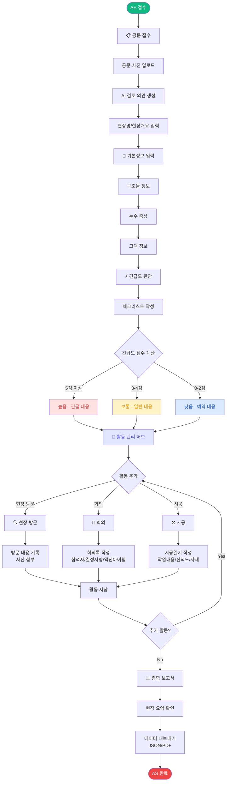
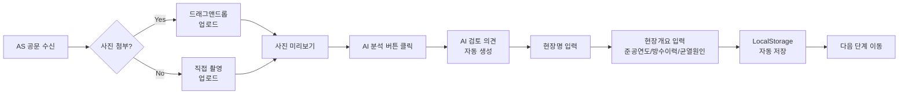
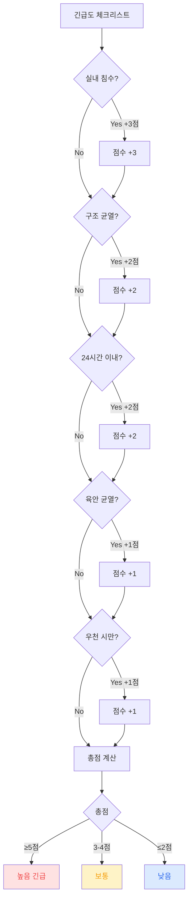
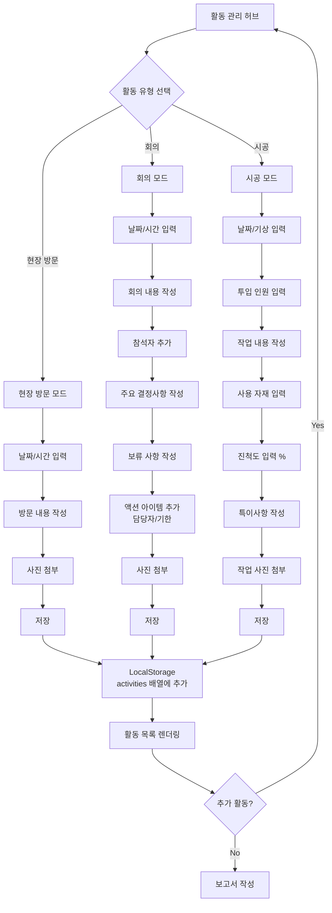
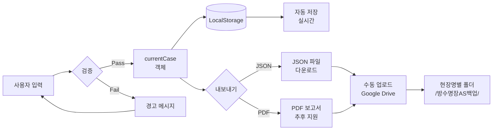
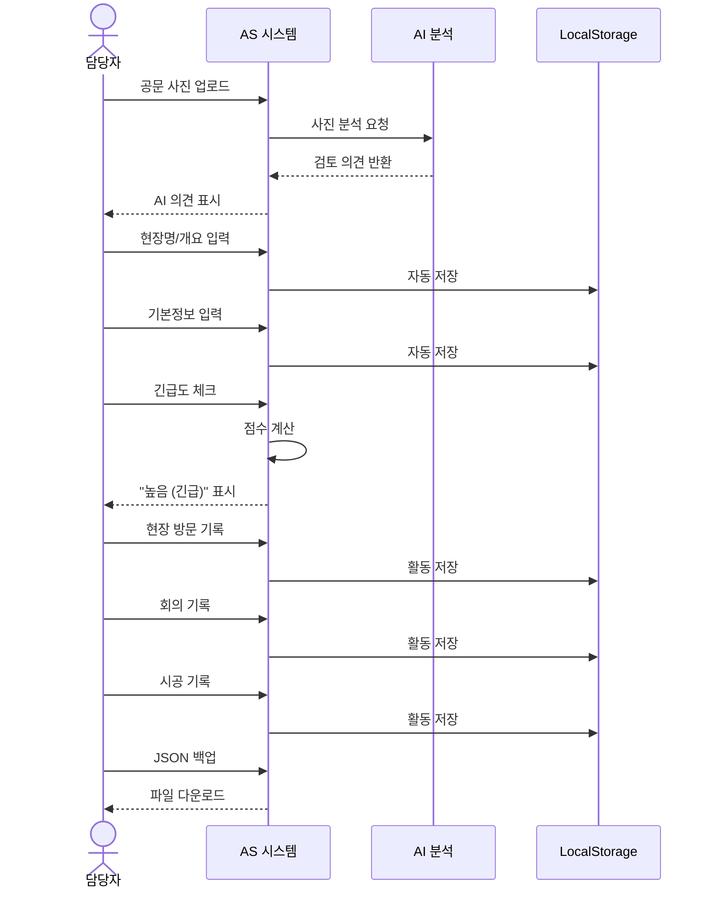
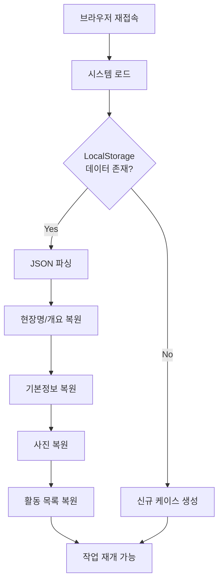
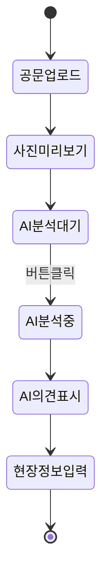
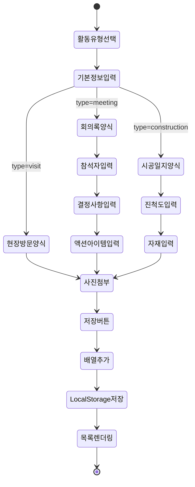
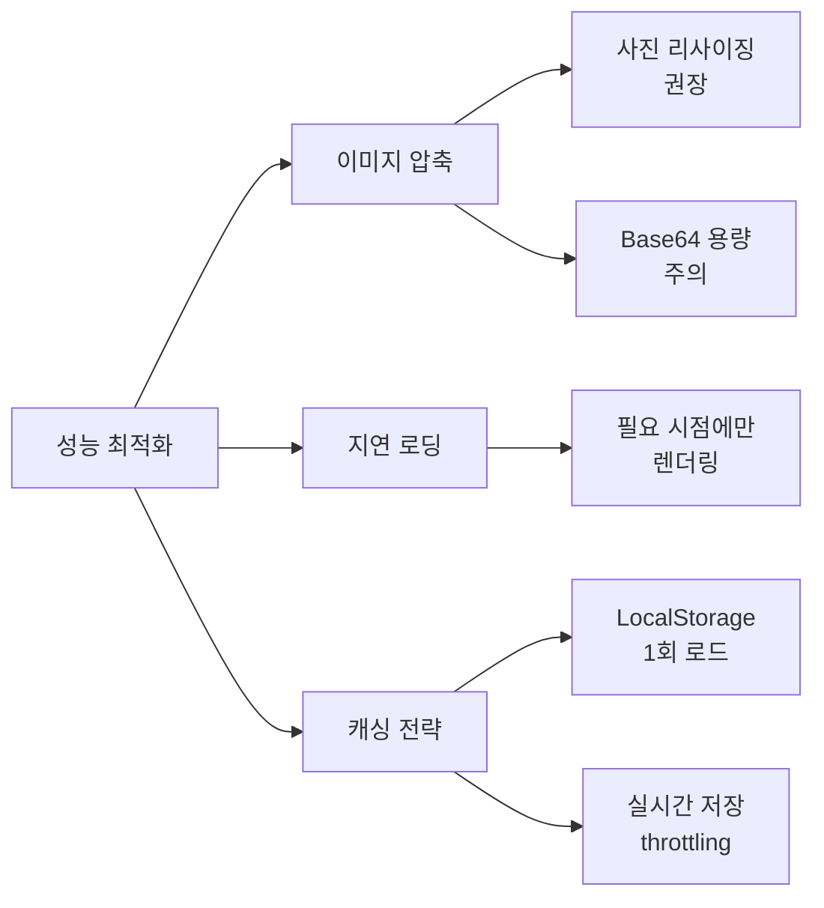

# 방수명장 AS 대응 프로세스 플로우차트

## 1. 전체 프로세스 개요



---

## 2. 상세 단계별 프로세스

### 2.1 공문 접수 프로세스



### 2.2 긴급도 판단 알고리즘



### 2.3 활동 관리 프로세스



### 2.4 데이터 흐름도



---

## 3. 데이터 구조

### 3.1 currentCase 객체 구조

```json
{
  "caseId": "AS-20260401-0001",
  "version": "3.0",
  "createdAt": "2026-04-01T00:00:00.000Z",
  "updatedAt": "2026-04-01T12:00:00.000Z",
  
  "officialDocPhotos": ["base64...", "base64..."],
  "aiAnalysis": "AI 검토 의견 텍스트",
  "siteName": "OO아파트 101동 옥상",
  "siteOverview": "2010년 준공, 기존 우레탄 방수...",
  
  "basicInfo": {
    "buildingType": "아파트",
    "constructionArea": "옥상",
    "constructionSize": "150",
    "completionYear": "2010",
    "mainSymptoms": "우천 시 실내 누수",
    "existingMethod": "우레탄 도막방수",
    "firstOccurrence": "2026-03-15",
    "clientName": "홍길동",
    "clientPhone": "010-1234-5678",
    "clientAddress": "서울시 강남구..."
  },
  
  "urgency": {
    "checklist": ["실내 침수", "구조 균열"],
    "score": 5,
    "level": "높음 (긴급)"
  },
  
  "activities": [
    {
      "id": 1711958400000,
      "type": "visit",
      "date": "2026-04-01",
      "time": "14:00",
      "content": "현장 사전 조사",
      "photos": ["base64..."]
    },
    {
      "id": 1711962000000,
      "type": "meeting",
      "date": "2026-04-02",
      "time": "10:00",
      "content": "보수 방안 협의",
      "photos": ["base64..."],
      "meetingMinutes": {
        "attendees": ["홍길동", "김기술", "이시공"],
        "decisions": "우레탄 전면 재시공 결정",
        "pending": "예산 최종 승인 대기",
        "actionItems": [
          {
            "task": "견적서 제출",
            "assignee": "김기술",
            "deadline": "2026-04-05"
          }
        ]
      }
    },
    {
      "id": 1711975600000,
      "type": "construction",
      "date": "2026-04-10",
      "time": "09:00",
      "content": "1일차 시공",
      "photos": ["base64..."],
      "constructionLog": {
        "weather": "맑음",
        "workers": "5",
        "work": "바탕면 정리 및 프라이머 도포",
        "materials": "프라이머 10L, 우레탄 방수재 30kg",
        "progress": "20",
        "notes": "바탕면 함수율 양호"
      }
    }
  ]
}
```

---

## 4. 핵심 모듈 설명

### 4.1 Navigation Module

```javascript
function goToStep(stepId) {
    // 1. 현재 스텝 검증
    if (!validateCurrentStep()) return;
    
    // 2. 모든 스텝 숨김
    hideAllSteps();
    
    // 3. 타겟 스텝 표시
    showStep(stepId);
    
    // 4. 네비게이션 업데이트
    updateNavigation(stepId);
    
    // 5. 자동 저장
    saveToLocalStorage();
}
```

### 4.2 Photo Upload Module

```javascript
function handlePhotoUpload(e, targetArray) {
    const files = Array.from(e.target.files);
    
    files.forEach(file => {
        if (file.type.startsWith('image/')) {
            const reader = new FileReader();
            
            reader.onload = (e) => {
                // Base64로 변환
                targetArray.push(e.target.result);
                
                // 미리보기 렌더링
                renderPhotos();
                
                // 자동 저장
                saveToLocalStorage();
            };
            
            reader.readAsDataURL(file);
        }
    });
}
```

### 4.3 Activity Management Module

```javascript
function saveActivity() {
    // 1. 유형별 데이터 수집
    const baseData = collectBaseData();
    
    // 2. 회의록/시공일지 추가 데이터
    if (type === 'meeting') {
        baseData.meetingMinutes = collectMeetingData();
    }
    if (type === 'construction') {
        baseData.constructionLog = collectConstructionData();
    }
    
    // 3. activities 배열에 추가
    currentCase.activities.push(baseData);
    
    // 4. UI 업데이트
    renderActivities();
    
    // 5. 저장
    saveToLocalStorage();
}
```

### 4.4 LocalStorage Module

```javascript
function saveToLocalStorage() {
    // 1. 업데이트 시간 갱신
    currentCase.updatedAt = new Date().toISOString();
    
    // 2. JSON 직렬화
    const jsonString = JSON.stringify(currentCase);
    
    // 3. LocalStorage 저장
    localStorage.setItem('waterproofing_as_case', jsonString);
    
    // 4. 자동 저장 표시
    showAutoSaveIndicator();
}

function loadFromLocalStorage() {
    // 1. 데이터 로드
    const saved = localStorage.getItem('waterproofing_as_case');
    
    if (!saved) return;
    
    // 2. JSON 파싱
    currentCase = JSON.parse(saved);
    
    // 3. UI 복원
    restoreAllFields();
    renderAllPhotos();
    renderActivities();
}
```

---

## 5. 사용자 시나리오

### 시나리오 1: 긴급 누수 접수



### 시나리오 2: 데이터 복원



---

## 6. 저장소 구조

### 6.1 LocalStorage 구조

```
localStorage
├─ waterproofing_as_case (JSON string)
│  └─ currentCase 객체 전체
```

### 6.2 Google Drive 폴더 구조 (수동 업로드)

```
Google Drive/
└─ 방수명장AS백업/
    └─ OO아파트_101동_옥상/
        └─ AS-20260401-0001/
            ├─ AS백업_OO아파트_AS-20260401-0001_2026-04-01.json
            ├─ 공문사진_1.jpg
            ├─ 공문사진_2.jpg
            ├─ 현장방문1차_사진1.jpg
            ├─ 회의_사진1.jpg
            └─ 시공1일차_사진1.jpg
```

---

## 7. 주요 기능 흐름

### 7.1 공문 접수 → AI 분석



### 7.2 활동 추가 → 저장



---

## 8. 옵션 A 특징 요약

| 항목 | 설명 |
|------|------|
| **저장 방식** | LocalStorage (브라우저 내 자동 저장) |
| **백업 방식** | JSON 파일 수동 다운로드 |
| **Google Drive 연동** | 수동 업로드 (사용자가 직접) |
| **AI 분석** | Mock 버전 (실제 AI는 미연동) |
| **데이터 영속성** | 브라우저 저장 (수정해도 보존) |
| **사진 저장** | Base64 인코딩 (JSON 내 포함) |
| **PDF 내보내기** | 추후 업데이트 예정 |
| **모바일 대응** | 반응형 디자인 지원 |
| **설치 필요** | 없음 (HTML 파일만) |
| **서버 필요** | 없음 (완전 오프라인 동작) |

---

## 9. 개발 로드맵

### Phase 1: 옵션 A (현재) ✅
- HTML 단일 파일
- LocalStorage 저장
- JSON 백업
- Mock AI 분석

### Phase 2: 옵션 B (차후)
- Google Drive API 연동
- 자동 백업 기능
- Flask 백엔드 서버
- OAuth 인증

### Phase 3: 옵션 C (차후)
- 실제 AI 사진 분석
- PDF 자동 생성
- 이메일 자동 발송
- 대시보드 통계

---

## 10. 기술 스택

| 구분 | 기술 |
|------|------|
| **프론트엔드** | HTML5, CSS3, Vanilla JavaScript |
| **저장소** | LocalStorage API |
| **이미지 처리** | FileReader API (Base64) |
| **반응형** | CSS Grid, Flexbox, Media Queries |
| **아이콘** | Emoji (별도 라이브러리 없음) |
| **데이터 포맷** | JSON |
| **브라우저 지원** | Chrome, Edge, Safari, Firefox (최신 버전) |

---

## 11. 성능 최적화 전략



---

*본 플로우차트는 방수명장 AS 대응 프로세스 v3.0 (옵션 A) 기준으로 작성되었습니다.*
